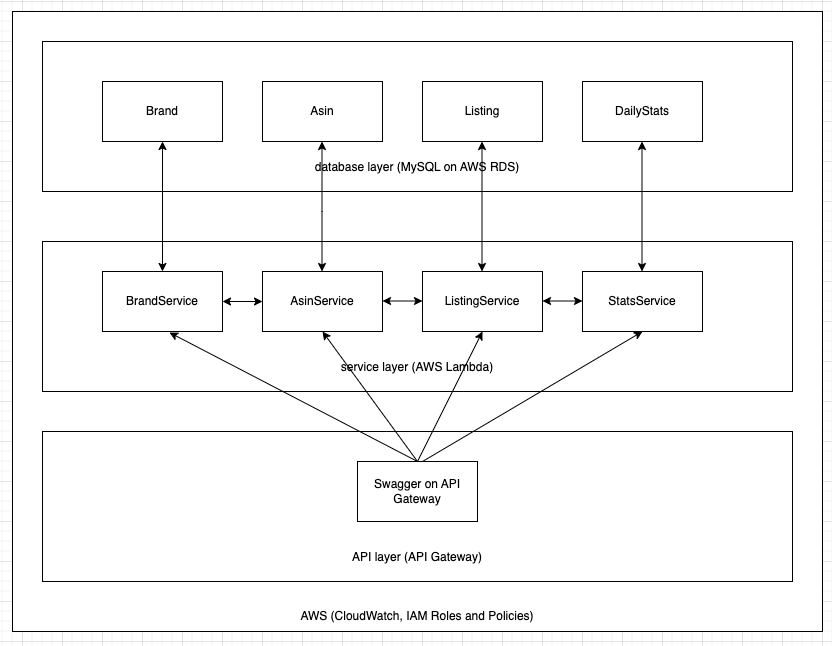
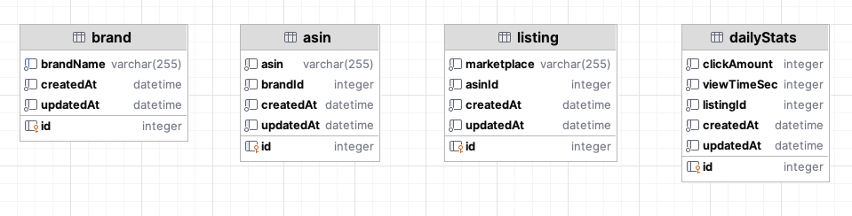

### Architecture proposal

## Database layer

Our data is well organized, and we know exactly what kind of data we want to have, thus relational database is my suggestion.
To keep the flexibility I would choose one of the relational database that are supported by AWS RDS service. I have
worked more with Aurora (MySQL), thus I would choose this. In general, the difference to Postgres is not that significant 
from my point of view.

For each entity we will create a separate table. In case we consider a lot of data, it is worth having each table in a 
separate database, however, most probably it is unnecessary. It is important to note that with AWS RDS we will allow us 
to increase the capacity of our database instance. Important to remember that we can create replicas which will allow us 
to keep the data even if something happens to the main one.

This is the basic example, how the database structure could look like.

Important to notice that there no foreign keys as we want to achieve the autonomy for every entity. This way
we are able to put each table to a separate database. However, we have references to other tables.

## Service layer

For each entity there will be a service that is responsible for operations specifically with that entity. We could consider 
running all services in one instance, but for better scalability, let's divide those. I would choose AWS Lambda as a service, 
thus we will get 4 lambdas. The plus of AWS Lambda is that we are paying only per execution time plus resources, thus 
if one service is never called we will be able to save the money.

In case some service need the data from another entity, it calls to another service which handles this entity. For example,
if statistics needs based on the brand, StatsService will send a request to BrandService to verify that this brand exists 
or get necessary data, but not directly to the database. This way each service encapsulates its logic and data, so other services
don't need to understand or deal with internal database structures.

## API level

In general, it is nice to get the data throw the API, so I would choose API Gateway that will help us route the traffic
to the correct service lambda. Moreover, it is possible to integrate Swagger into API Gateway. From my point of view,
Swagger helps to understand the usage of API better as it provides the possible resources with the examples, so API 
documentation together with the opportunity to execute it. Swagger file will contain the routes to the service level.

## Statistics

In case there is a dashboard that shows the statistics, the main requests will go to this service. It might be an overkill
to call other services for the same data, thus it is good to introduce caching, this way we will be able to save time and money.
Moreover, in case other services are unavailable we might be able to proceed without them as we have the data in cache.
When there is no data in the cache, we should introduce the retry logic with configurable value as well as timeout for 
this type or requests. This way we will be able to retrieve data after some time if the targeted service comes up.
